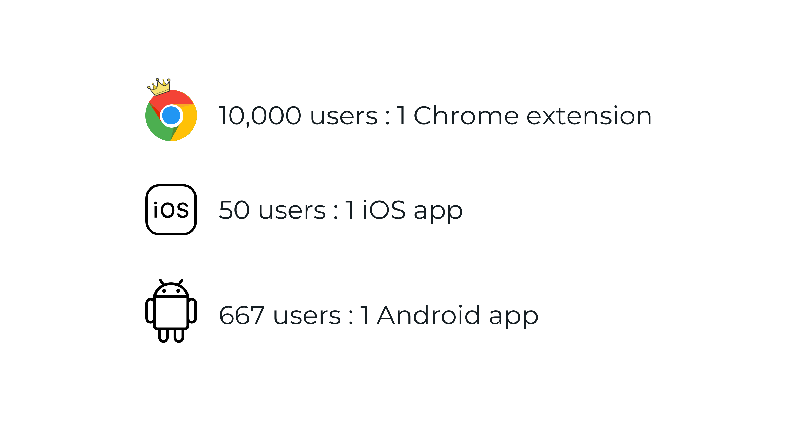

<!-- prettier-ignore -->
Browser extensions are all the rage nowadays. In fact, some companies build their entire businesses on browser extensions. [Honey](https://www.joinhoney.com/), the Chrome extension that applies promo codes at checkout online, was recently bought out by PayPal for a whopping $4 billion. That's right, _billion_ with a _B_.

What does this mean for developers and businesses? Should you build a browser extension? Let's break it down.

## Brief history of modern browser extensions

- The first browser extension was made for Internet Explorer in 1999.
- Firefox launched and shipped with extension support in 2004.
- Chrome and Safari started supporting extensions in 2009.
- In 2010, Chrome opened the Chrome Web Store to install extensions. Chrome surpassed Internet Explorer in usage in 2012.
- Microsoft Edge launched in 2015, replaced Internet Explorer on Windows 10 and added extension support in 2016.
- In 2015, a [browser extension API standard initiative](https://browserext.github.io/browserext/) was created by a W3C community group with a goal to standardize browser extensions API's.

### Present day

Chrome's extension API is based completely on HTML, CSS, and JavaScript. Browsers like Microsoft Edge, Opera, and Brave are Chromium-based and all have very similar API's. Firefox's extension API is also largely compatible with Chrome's, with a [few exceptions](https://developer.mozilla.org/en-US/docs/Mozilla/Add-ons/WebExtensions/Chrome_incompatibilities).

According to [Stat Counter](https://gs.statcounter.com/browser-market-share), Chrome currently owns 65% of the browser market share, with claims from Google of over [2 billion active Chrome browsers in 2016](https://techcrunch.com/2016/11/10/google-says-there-are-now-2-billion-active-chrome-installs/). Currently, there are almost 200,000 extensions on the Chrome Web Store. By comparison, there are more than 2 million apps in the Apple App Store and almost 3 million apps in the Google Play Store.

<!-- prettier-ignore -->
Not everyone is on board the gravy train, however. Safari, which has a 15% browser market share, is a lone wolf when it comes to their extension API. Safari extensions can be made in XCode using a combination of CSS, JavaScript, and native code written in Objective-C or Swift. To be published as an official extension in Apple’s Safari Extension Gallery, you need Apple Developer Program membership, which is $99/year.

## Is a browser extension a good move for your product?

Now that you have an idea of the modern browser extension landscape, it's natural for you to ask – is building an extension the right move to build and ship a new product idea?

The answer is a resounding... **YES**.

Due to the immense popularity of Chrome, quick development leveraging Chrome's extension API, and the ease of publishing to the Chrome Web Store, it has never been easier or cheaper getting a valuable shipped product to the most users.

Doing some ratio math, you can figure out the relative competition with other products:

- In the Chrome Web Store, you have 2 billion Chrome users : 200,000 Chrome extensions = **10,000 users : 1 Chrome extension**.

- In the Apple App Store, you have 100 million iPhone users : 2 million iOS apps = **50 users : 1 iOS app**.

- In the Google Play Store, you have 2 billion Android users : 3 million Android apps = **667 users : 1 Android app**.

Clearly, you can see there's a competitive advantage of launching a browser extension (especially a Chrome extension) over launching on other platforms. This is especially true if you want to get the most people using your product right away. By sheer numbers alone, launching a Chrome extension gives you 200 times more potential users than an iOS app. If you also consider development costs of a Chrome extension over an iOS app, the advantage grows even more.

### Some caveats

Now, of course, browser extensions aren't magic. They fall victim to the same problems new software products face, which is that no one downloads or installs new software anymore. You will still have to do the hard work to get users. In addition, browser extensions can only solve a specific set of problems on websites, and you are limited by the extension API.

With these 2 points in mind, after fitting your product's scope for an extension, getting enough dedicated users, you can grow your product's services by expanding to other platforms.

## Getting started and essential knowledge for developers

I learned some lessons building the [Minimal Twitter](https://twang.dev/minimal-twitter/) extension, which currently has more than [1,600 users on Chrome](https://chrome.google.com/webstore/detail/minimal-twitter/pobhoodpcipjmedfenaigbeloiidbflp) and more than [700 users on Firefox](https://addons.mozilla.org/en-US/firefox/addon/min-twitter/).

My recommended flow to developing extensions is to go Chrome > Firefox > Safari. I launched the Chrome extension first by sharing it on Twitter, and decided to go ahead and port to Firefox and Safari after receiving a lot of positive reception.

import Tweet from "src/components/tweet"

<Tweet tweetId="1151678982229643264" />

With these 3 browsers alone, you will have about 90% coverage of the browser market. Since many other modern browsers are Chromium-based, taking those into account you will likely have close to 100% coverage.

### Recommended development steps

#### 1. Chrome Extension

The [Chrome Developer Extensions website](https://developer.chrome.com/extensions) has everything you need to make a new extension – tutorials, documentation, and instructions on publishing to the Chrome Web Store.

#### 2. Port to Firefox

Firefox extensions are called Add-ons. They have an Extension Workshop for [Porting a Google Chrome extension](https://extensionworkshop.com/documentation/develop/porting-a-google-chrome-extension/). The MDN web docs also have a page on [Building a cross-browser extension](https://developer.mozilla.org/en-US/docs/Mozilla/Add-ons/WebExtensions/Build_a_cross_browser_extension).

#### 3) Port to Safari

There are key differences in Safari extensions, and depending on the complexity of your Chrome extension, it may be more work to port. Apple has a documentation page called [Converting Chrome Extensions](https://developer.apple.com/library/archive/documentation/UserExperience/Conceptual/SafariExtensionsConversionGuide/Chapters/Chrome.html).

Tip: Use [Safari Extension Builder](https://developer.apple.com/library/archive/documentation/Tools/Conceptual/SafariExtensionGuide/UsingExtensionBuilder/UsingExtensionBuilder.html) to avoid configuring things by hand in XCode.

## What all this means for the future of the web

Believe it or not, the web as a platform is only 30 years old. It might be more crowded than ever before with [almost 2 billion websites](https://www.internetlivestats.com/total-number-of-websites/), but the web platform has been given new life with browser extensions.

The emergence of Chrome has brought along exciting new ways to create useful products. However, there are issues with Chrome's market dominance, as seen when Google recently [restricted modern ad blocking extensions](https://ww.9to5google.com/2019/05/29/chrome-ad-blocking-enterprise-manifest-v3/), or privacy issues like [Gmail forcing logging into Chrome](https://gizmodo.com/google-chrome-is-now-quietly-forcing-you-to-log-in-here-1829265681). It'll be interesting to see if Chrome can keep its grips on the market in the next decade. Still, we have Google Chrome to thank for democratizing the browser extension space, and it should only get better from here.

<iframe
  width="560"
  height="315"
  src="https://www.youtube.com/embed/es9DNe0l0Qo"
  frameborder="0"
  allow="accelerometer; autoplay; encrypted-media; gyroscope; picture-in-picture"
  allowfullscreen
></iframe>
